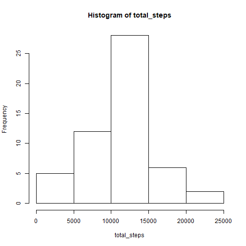
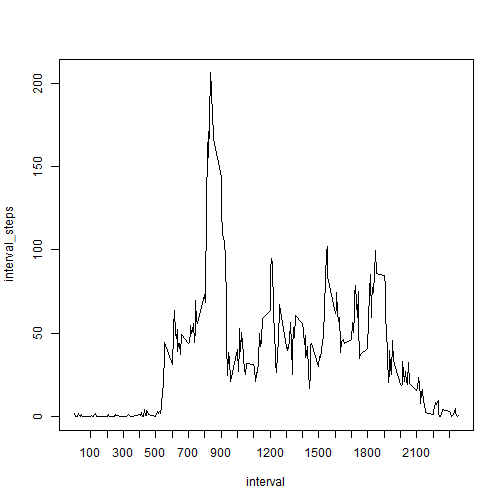
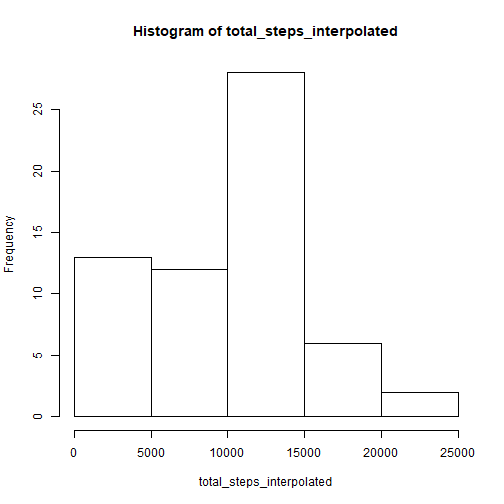
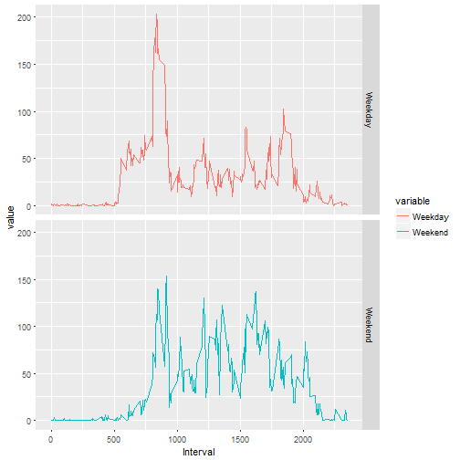

## Loading and preprocessing the data


```r
  if(!file.exists("activity.csv")) {
    if(!file.exists("repdata%2Fdata%2Factivity.zip")) {
      fileURL <- "https://d396qusza40orc.cloudfront.net/repdata%2Fdata%2Factivity.zip"
      download.file(fileURL, "repdata%2Fdata%2Factivity.zip")
    }
    unzip("repdata%2Fdata%2Factivity.zip")
  }
  data<-read.csv("activity.csv")
  data<-mutate(data, date=as.POSIXct(data$date,format="%Y-%m-%d", tz="GMT"))
```

## What is mean total number of steps taken per day?

```r
  total_steps<-tapply(data$steps, data$date, sum)
  hist(total_steps)
```



```r
  total_mean<-mean(total_steps, na.rm=TRUE)
  total_median<-median(total_steps, na.rm=TRUE)
```
The mean and median number of steps per day are 10766.1886792 and 10765 respectively.

## What is the average daily activity pattern?

```r
  interval_steps<-tapply(data$steps, data$interval, mean, na.rm=TRUE)
  interval<-unique(data$interval)
  plot(interval, interval_steps, type="l", xaxt="n")
  axis(side=1, at = interval[seq(13,288,12)])
```



```r
  max_interval<-interval[which.max(interval_steps)]
  max_steps<-interval_steps[which.max(interval_steps)]
```
The maximum number of steps in an interval is 206.1698113, occuring at the 835 interval.

## Imputing missing values

```r
  num_nas<-sum(is.na(data$steps))
```
The number of NA values is 2304.


```r
  data_continuous_interval<-mutate(data, total=seq(0,17568*5-1,5))
  steps_interpolated_by_interval<-na.approx(data_continuous_interval[,c(4,1)], rule=2)
  data_interpolated<-mutate(data, steps=steps_interpolated_by_interval[,2])
  total_steps_interpolated<-tapply(data_interpolated$steps, data_interpolated$date, sum)
  hist(total_steps_interpolated)
```



```r
  interp_mean<-mean(total_steps_interpolated)
  interp_median<-median(total_steps_interpolated)
```
After interpolating the missing data, the mean has decreased from 10766.1886792 to 9354.2295082, while the median has decreased from 10765 to 10395.


## Are there differences in activity patterns between weekdays and weekends?

```r
  day<-sapply(data_interpolated$date, weekdays)
  weekend<-day %in% c("Saturday", "Sunday")
  day_factor<-as.factor(ifelse(weekend==TRUE,"Weekend", "Weekday"))
  data_day<-mutate(data_interpolated, day=day_factor)
  data_weekday<-filter(data_day, day==day_factor[1])
  data_weekend<-filter(data_day, day!=day_factor[1])
  weekday_interval_steps<-tapply(data_weekday$steps, data_weekday$interval, mean)
  weekend_interval_steps<-tapply(data_weekend$steps, data_weekend$interval, mean)
  weekend_weekday_steps<-cbind(interval, weekday_interval_steps, weekend_interval_steps)
  colnames(weekend_weekday_steps)<-c("Interval","Weekday", "Weekend")
  data_melted<-melt(as.data.frame(weekend_weekday_steps), id.vars="Interval")
  p<-ggplot()+geom_line(data=data_melted, aes(x=Interval, y=value, color=variable))+facet_grid(variable~.)
  print(p)
```


